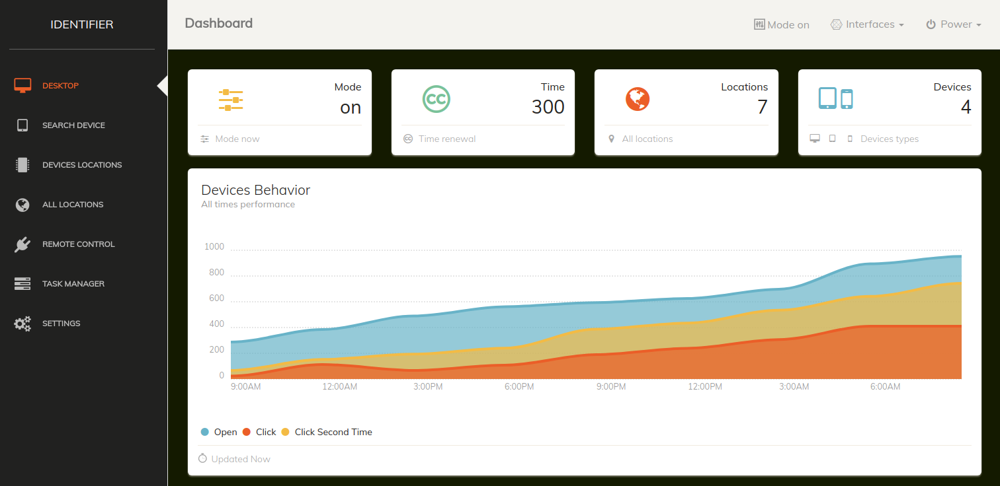
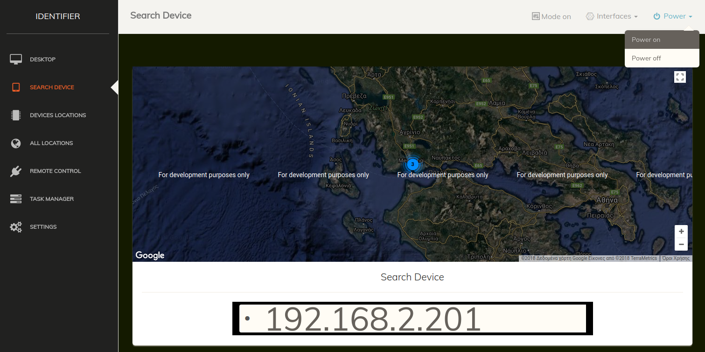
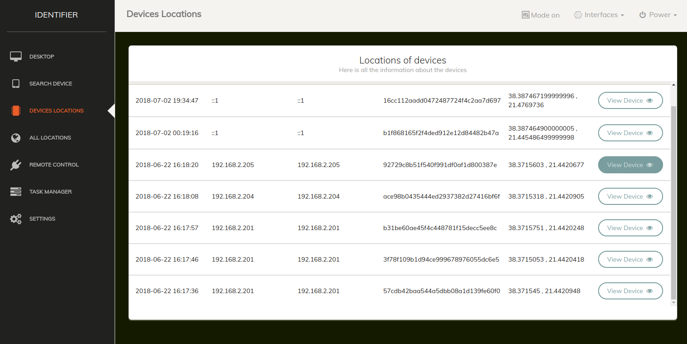
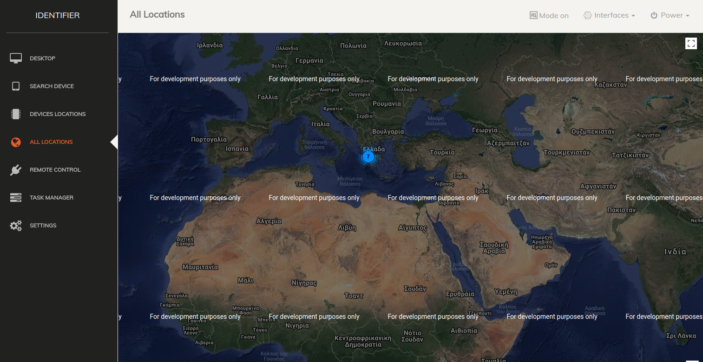
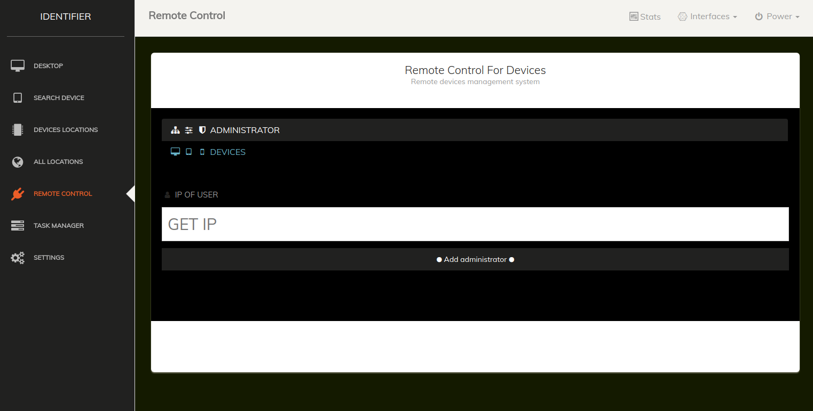
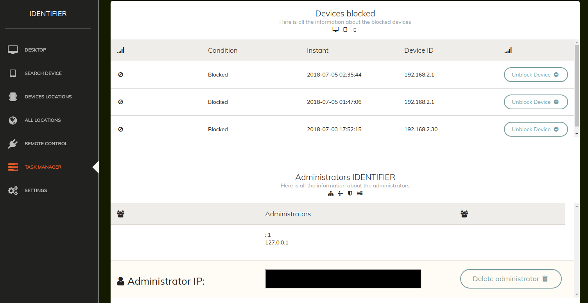

# identifier
To identifier is a program for locating computers tablets and mobile phones

Details identifier   
finding location of computers, latops, tablets  and mobile phones  
Live follow-up of multi-device locations  
plan of all devices connected to the system  
plan of the device separately on the map  
device search  
connecting remote computers in the management system  
blocke any device  

1) Installation instructions   
   
  i) Import the file database.sql from sql folder to your database system  
  ii) Copy the identifier program and paste in one folder into /var/www/  
  iii) The identifier program is ready for use <br.   
  
 
2) To find the location of the devices   
   
   i) Send the following link to the user you want to locate  
      The link is your ip and the following folder TLP_LOCATION  
      
      example lan: https://localhost/identification/TMP_LOCATION/  
      example wan: https://localhost/45.50.60.70/TMP_LOCATION/  
      in his case wan do not forget to do it open the port in router   
      
      
   ii)  Finding a Computer Location  
    For the operation of the program on tablets and mobile phones o the user should have a connection to the internet such as wifi or  the cellular data and have opened the location for precise positioning   
   
   iii) Find tablet and mobile phone location  
   To identify computers and laptops you need one connection to the Internet. The location here may vary a few meters because you do not use gps as on tablets and cell phones   
  
   
   
   
   
   
   
   
   
